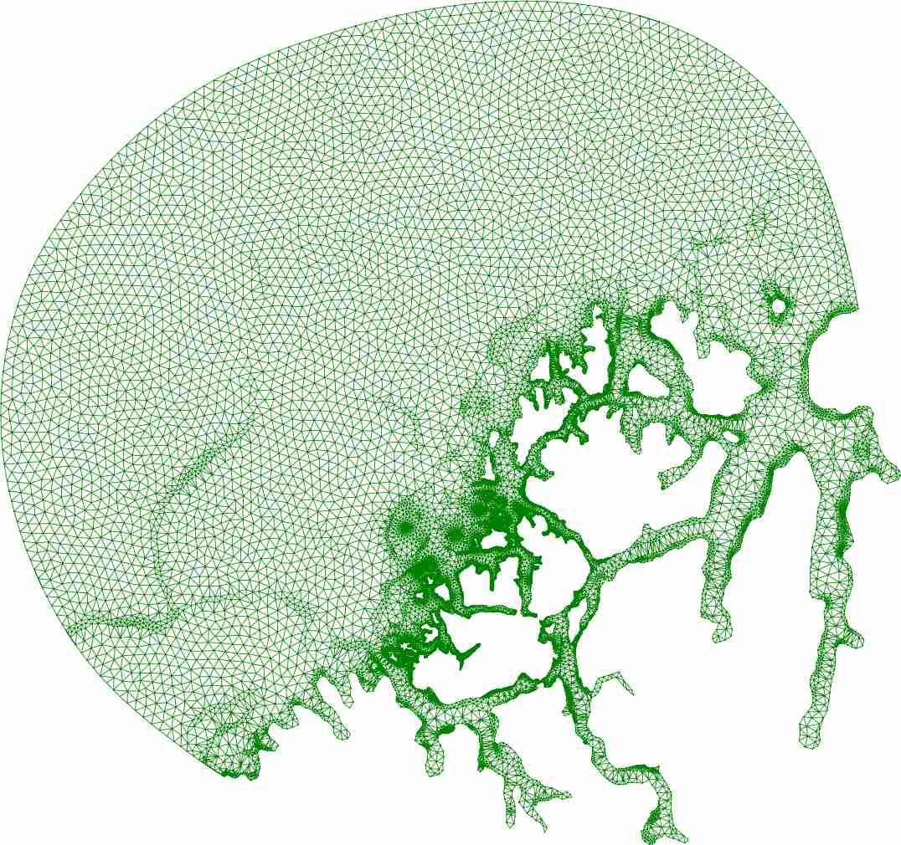

Simple mesh generator in Python (fork of PyDistMesh)
====================================================

.. image:: https://travis-ci.org/bast/smeshing.svg?branch=master
   :target: https://travis-ci.org/bast/smeshing/builds

.. image:: https://coveralls.io/repos/github/bast/smeshing/badge.svg?branch=master
   :target: https://coveralls.io/github/bast/smeshing?branch=master

.. image:: https://img.shields.io/badge/license-%20GPL--v3.0-blue.svg
   :target: https://github.com/bast/smeshing/blob/master/LICENSE

This version of the code is based on
`PyDistMesh <https://github.com/bfroehle/pydistmesh>`__ developed by
`Bradley M. Froehle <https://github.com/bfroehle>`__. This code
generates unstructured triangular meshes using signed
distance functions. Like
`DistMesh <http://persson.berkeley.edu/distmesh/>`__ and
`PyDistMesh <https://github.com/bfroehle/pydistmesh>`__ upon which this
work is based, this code is distributed under the `GNU
GPL <../master/LICENSE>`__.

Status and roadmap for this fork
--------------------------------

Prototyping work is currently done in Python. Later we will probably
move to Fortran or C(++) and introduce parallelization but provide a
Python interface.

Nice things about this code
---------------------------

-  Individual components live in separate libraries.
-  A lot of effort was invested in avoiding quadratic scaling.
-  Optimization is fully relaxed.
-  Delaunay is performed at every step.
-  Good memory profile (hopefully, please report if not).
-  Gives the user a lot of flexibility to define a distance-dependent resolution.

Known issues
------------

-  Code uses shared-memory parallelization but the load leveling is not
   optimal and the scaling has not been studied in detail.

References
----------

The DistMesh algorithm is described in the following two references. If
you use the algorithm in a program or publication, please acknowledge
its authors by adding a reference to the first paper below.

-  `P.-O. Persson, G. Strang, A Simple Mesh Generator in MATLAB, SIAM
   Review, Volume 46 (2), pp. 329-345, June
   2004 <http://persson.berkeley.edu/distmesh/persson04mesh.pdf>`__
-  `P.-O. Persson, Mesh Generation for Implicit Geometries, Ph.D.
   thesis, Department of Mathematics, MIT, Dec
   2004 <http://persson.berkeley.edu/thesis/persson-thesis-color.pdf>`__

Installation
============

Installation using virtualenv
-----------------------------

::

  virtualenv venv
  source venv/bin/activate

  pip install --process-dependency-links git+https://github.com/bast/smeshing.git

  smesh --help

Installing dependencies for development
---------------------------------------

::

  virtualenv venv
  source venv/bin/activate
  pip install -r requirements.txt

Installation on the `Stallo <https://www.sigma2.no/content/stallo>`__ supercomputer
-----------------------------------------------------------------------------------

.. code-block:: bash

  #!/bin/bash

  #SBATCH --account=your-account
  #SBATCH --job-name=install
  #SBATCH --ntasks=1
  #SBATCH --time=0-01:00:00
  #SBATCH --partition short
  #SBATCH --mem-per-cpu=1000MB
  #SBATCH --mail-type=ALL

  module purge
  module load foss/2016b
  module load Python/3.5.2-foss-2016b
  module load CMake/3.7.1-foss-2016b
  module load libffi/3.2.1-foss-2016b

  cd ${SLURM_SUBMIT_DIR}

  python3 -m venv venv
  source venv/bin/activate

  python --version

  export CC=gcc
  export CXX=g++
  export FC=gfortran

  pip install --process-dependency-links git+https://github.com/bast/smeshing.git

Running tests
-------------

::

    py.test -vv smeshing/*.py

How to run the code
===================

Launching the code
------------------

The code is launched using the ``smesh`` script. Example::

  $ smesh --boundary=/home/user/smeshing/data/happy-bear/boundary.txt \
          --islands=/home/user/smeshing/data/happy-bear/islands.txt \
          --config=/home/user/smeshing/data/happy-bear/config.yml \
          --output=data.txt

For an explanation of the options try::

  $ smesh --help

  Usage: smesh [OPTIONS]

  Options:
    --boundary TEXT           File containing boundary data.
    --islands TEXT            Island file names (it is possible to use
                              wildcards).
    --resolution-fields TEXT  File name(s) containing resolution fields (it is
                              possible to use wildcards).
    --config TEXT             Read configuration from this file.
    --output TEXT             Write output to this file.
    --restart TEXT            Restart from this file.
    --help                    Show this message and exit.

You can take the files here as a starting point: https://github.com/bast/smeshing/tree/master/data/happy-bear

Example run script for the `Stallo <https://www.sigma2.no/content/stallo>`__ supercomputer
------------------------------------------------------------------------------------------

.. code-block:: bash

  #!/bin/bash

  #SBATCH --account=your-account
  #SBATCH --job-name=smesh
  #SBATCH --nodes=1
  #SBATCH --ntasks-per-node=20
  #SBATCH --exclusive
  #SBATCH --time=0-00:10:00
  #SBATCH --partition short
  #SBATCH --mem-per-cpu=500MB
  #SBATCH --mail-type=ALL

  # load a couple of modules
  module purge
  module load foss/2016b
  module load Python/3.5.2-foss-2016b
  module load libffi/3.2.1-foss-2016b

  # use all available threads for shared-memory parallelization
  export OMP_NUM_THREADS=${SLURM_TASKS_PER_NODE}

  # compile the custom functions
  cd ${SLURM_SUBMIT_DIR}
  g++ -O3 -shared -fpic custom_functions.cpp -o libcustom_functions.so

  # this will define the custom functions for the meshing code
  export LD_PRELOAD=${SLURM_SUBMIT_DIR}/libcustom_functions.so

  # load the virtual environment that contains the installation
  source /home/user/smeshing/venv/bin/activate

  # start the actual code
  smesh --boundary=${SLURM_SUBMIT_DIR}/boundary.txt \
        --islands=${SLURM_SUBMIT_DIR}/islands.txt \
        --config=${SLURM_SUBMIT_DIR}/config.yml \
        --output=${SLURM_SUBMIT_DIR}/data.txt

  exit 0

How to provide polygon data for the boundary and islands
--------------------------------------------------------

Boundary polygon data has to be in a separate file from island data but both are given
in the same format. Island data polygons can be all in one file, or in multiple files.
Each polygon starts with one line specifying the number of points, followed by the polygon points,
each point in one line. First and last point of the polygon have the same coordinates.

As an example, this file contains two polygons, one with 5 points, one with 4 points::

  5
  0.0 0.0
  1.0 0.0
  1.0 1.0
  0.0 1.0
  0.0 0.0
  4
  5.0 0.0
  6.0 0.0
  6.0 1.0
  5.0 0.0

It would be equally fine to split this file into two files if you prefer.

Configuration
-------------

Configuration is given in YAML format. You can name the configuration file as
you like, for instance ``config.yml``.  The order of keywords does not matter
and you can add comments as in this example:

.. code-block:: yaml

  # number of grid points
  num_grid_points: 5000

  # number of all boundary and coastline interpolation points
  # these will not be part of the grid points
  # instead of num_interpolation_points you can also provide
  # interpolation_step_length using the same units as the coordinates of your data
  num_interpolation_points: 1000

  # number of iterations
  num_iterations: 100

How to express the resolution function
--------------------------------------

Grid points move depending on forces and forces depend on the resolution. You
have to define the resolution yourself by writing a C++ file, compiling it, and
feeding it to the meshing algorithm using ``LD_PRELOAD``. To get you started,
here is an example ``custom_functions.cpp``:

.. code-block:: cpp

  // provides std::max
  #include <algorithm>

  // The resolution is expressed as distance using the same (arbitrary)
  // units as used by the boundary and polygons - this means that
  // larger resolution number means that points are farther apart.

  // Resolution in point r is defined as min(f(r, p)), where the miminum
  // is taken over all boundary points p for a particular boundary point p,
  // f is given as f(r, p) = g(d(r, p)) + h(c_p).
  // d(r, p) is the distance r to p and function h(c_p) depends on
  // coefficients c_p of a boundary point p. The number of coefficients
  // per point and their meaning can be freely specified and interpreted.

  // Below you are asked to specify functions g and h.
  // You have two restrictions:
  // 1) You have to respect is that g should not decrease for an increasing d.
  //    In other words, for an increasing distance the resolution should not
  //    decrease.
  // 2) The sum g + h should never become zero since the code will divide by
  //    the distance.

  // This function only depends on the distance to a boundary point but not
  // on coefficients at the boundary point.
  double g_function(const double distance)
  {
      // this is to make sure we do not end up with zero distance
      // and then try to divide by zero later
      double result = std::max(0.5, distance);

      return result;
  }

  // The code will give you all coefficients for a point in h_function
  // and then you can use and combine them freely.
  double h_function(const double coefficients[])
  {
      // in this example we simply return the first coefficient
      return coefficients[0];
  }

To see how this file can be compiled and provided to the meshing script, please
have a look at the run script example.

Adding resolution fields
------------------------

Sometimes the resolution should not only be dependent on the distance and the boundary
coefficients but also on local features. For this you can provide resolution fields
with the ``--resolution-fields`` flag. Point it to a file or files that contain the following
format::

  N
  x1 y1 r1
  x2 y2 r2
  ...
  xN yN rN

The code will then use this field to interpolate a local resolution for each of
the resolution fields. The resolution for a grid point is then given as the
minimum taken over all resolution fields and the distance-dependent resolution
provided by ``g_function + h_function``.

Restart
-------

It is possible to restart a calculation if you provide
``--restart=/path/to/restart/file``.

Design choices
==============

Why do we need to provide islands and the boundary separately?
--------------------------------------------------------------

- We compute view vectors for nearest neighbor polygon points in view. For the boundary
  they point to the "inside". For islands they point to the "outside".
- During the computation we need to figure out whether points are inside or outside of polygons.
  We want grid points to be inside the boundary but outside islands.

Why not using GeoJSON?
----------------------

GeoJSON is a nice and standard format but the choice was to prefer a custom format
for the following reasons:

- Meshing should not be restricted to geospatial data
- Meshing should not be restricted to longitude and
  latitude units of decimal degrees but operate on arbitrary units

Postprocessing
==============

The repository contains a tiny script which can be used to plot the generated
grid::

    python plot.py data/happy-bear/result.txt example.png
